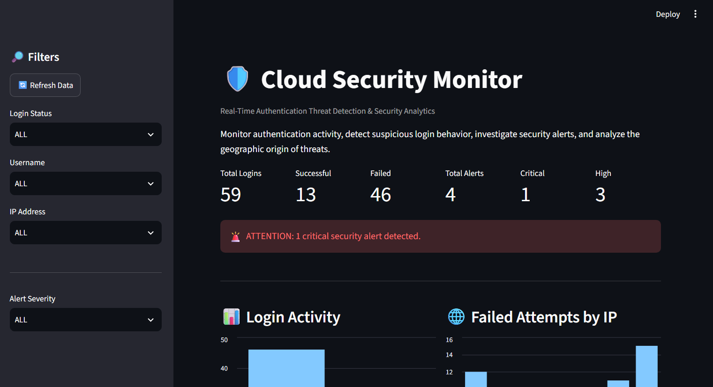
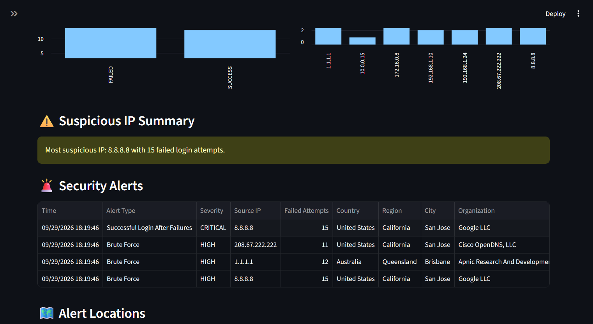
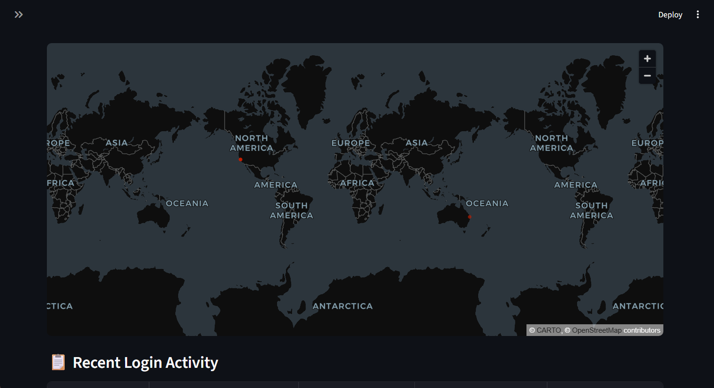

# 🛡️ Cloud Security Monitor

Cloud Security Monitor is a Python-based security monitoring tool that analyzes authentication activity for suspicious login behavior and displays detected threats through an interactive SOC-style dashboard.

It can simulate authentication traffic, detect brute-force attempts and possible account compromises, enrich suspicious IP addresses with geographic information, and store detected alerts in a SQLite database for investigation.

## 📸 Dashboard Preview



## 🚨 Detection Features

The monitor currently detects:

- **Brute-force attacks** — repeated failed login attempts from the same IP within a short time period
- **Successful login after repeated failures** — a successful authentication following multiple failed attempts from the same IP
- **Alert severity** — detected threats are classified as HIGH or CRITICAL
- **Duplicate prevention** — prevents the same detected activity from repeatedly creating identical alerts

### Alert Detection Preview



## 🌐 IP Enrichment

Suspicious public IP addresses are automatically enriched with:

- Country
- Region
- City
- Organization
- Latitude and longitude

### Threat Map



Geographic coordinates are used to visualize detected threats on the dashboard map.

## 📊 Dashboard

The Streamlit dashboard provides:

- Login, success, failure, and alert statistics
- HIGH and CRITICAL alert counts
- Login activity charts
- Failed attempts grouped by IP address
- Detailed security alert information
- Geographic threat visualization
- Filters for login status, username, IP address, and alert severity
- Manual data refresh

## 🛠️ Built With

- Python
- SQLite
- Pandas
- Streamlit
- PyDeck
- IP geolocation

## 📁 Project Structure

```text
cloud-security-monitor/
├── data/
│   └── login_events.csv
├── dashboard.py
├── database.py
├── detector.py
├── event_generator.py
├── ip_enrichment.py
├── upgrade_database.py
├── requirements.txt
├── .gitignore
└── README.md